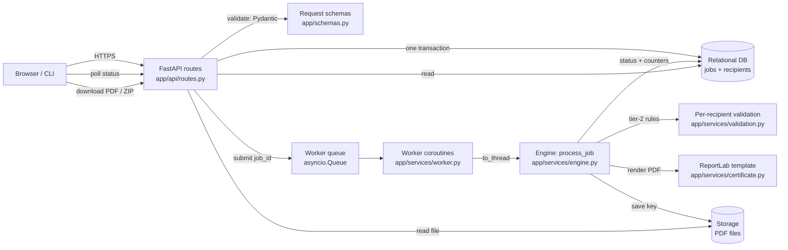
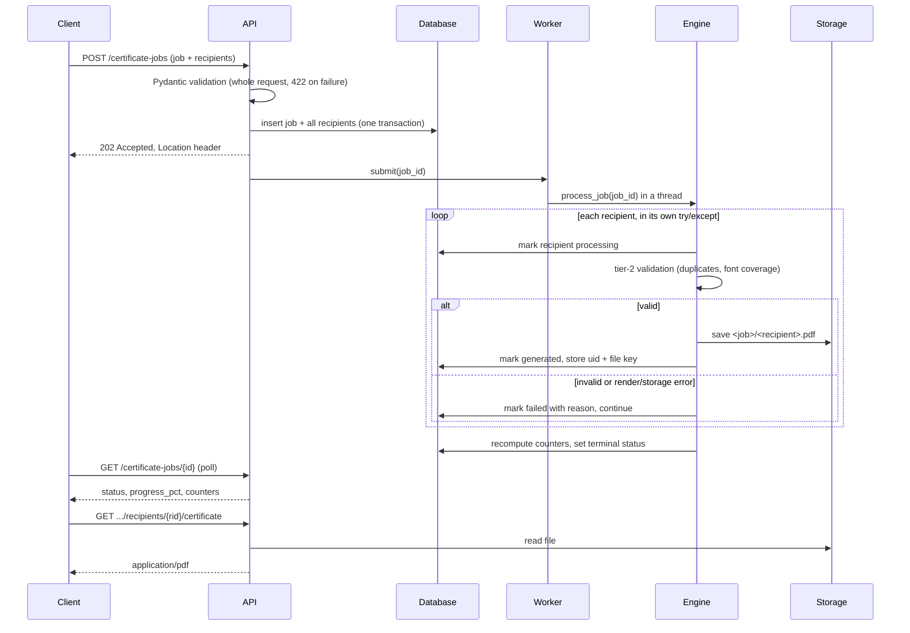
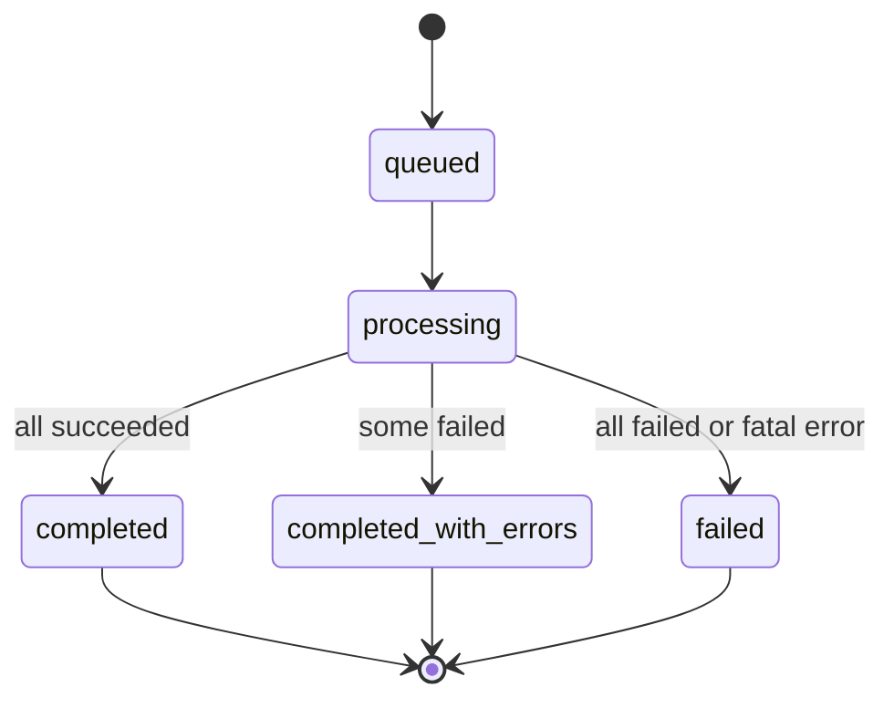

# Request and processing flow

## Components

```mermaid
flowchart LR
    U[Browser / CLI] -->|HTTPS| API[FastAPI routes<br/>app/api/routes.py]
    API -->|validate: Pydantic| SCH[Request schemas<br/>app/schemas.py]
    API -->|one transaction| DB[(Relational DB<br/>jobs + recipients)]
    API -->|submit job_id| Q[Worker queue<br/>asyncio.Queue]
    Q --> W[Worker coroutines<br/>app/services/worker.py]
    W -->|to_thread| E[Engine: process_job<br/>app/services/engine.py]
    E -->|tier-2 rules| V[Per-recipient validation<br/>app/services/validation.py]
    E -->|render PDF| C[ReportLab template<br/>app/services/certificate.py]
    E -->|save key| S[(Storage<br/>PDF files)]
    E -->|status + counters| DB
    U -->|poll status| API
    U -->|download PDF / ZIP| API
    API -->|read| DB
    API -->|read file| S
```

## Processing a job

```mermaid
sequenceDiagram
    participant C as Client
    participant A as API
    participant D as Database
    participant W as Worker
    participant E as Engine
    participant S as Storage

    C->>A: POST /certificate-jobs (job + recipients)
    A->>A: Pydantic validation (whole request, 422 on failure)
    A->>D: insert job + all recipients (one transaction)
    A-->>C: 202 Accepted, Location header
    A->>W: submit(job_id)
    W->>E: process_job(job_id) in a thread
    loop each recipient, in its own try/except
        E->>D: mark recipient processing
        E->>E: tier-2 validation (duplicates, font coverage)
        alt valid
            E->>S: save <job>/<recipient>.pdf
            E->>D: mark generated, store uid + file key
        else invalid or render/storage error
            E->>D: mark failed with reason, continue
        end
    end
    E->>D: recompute counters, set terminal status
    C->>A: GET /certificate-jobs/{id} (poll)
    A-->>C: status, progress_pct, counters
    C->>A: GET .../recipients/{rid}/certificate
    A->>S: read file
    A-->>C: application/pdf
```

## Job states

```mermaid
stateDiagram-v2
    [*] --> queued
    queued --> processing
    processing --> completed: all succeeded
    processing --> completed_with_errors: some failed
    processing --> failed: all failed or fatal error
    completed --> [*]
    completed_with_errors --> [*]
    failed --> [*]
```
